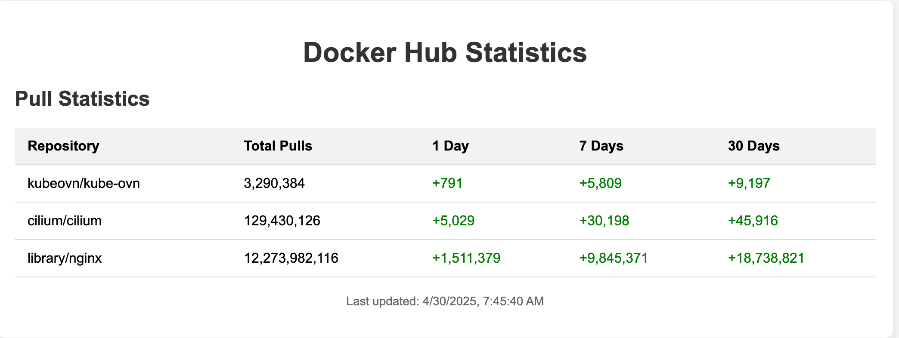

# **cf‑hubinsight**

> **CF Worker that logs DockerHub pulls count and visualizes it.**



## 🌟 Why we built this

Docker Hub shows only a single, ever‑growing "pulls" number for each public image.  
That's fine for bragging rights—but useless for answering questions like:

* _"How many people pull my images today?"_  
* _"Is our image trending this month?"_  

**cf‑hubinsight** exists to close that gap.  
By capturing the raw pull counter **hourly** and keeping a timestamped history, we can provide the open‑source community with:

* **Daily / weekly / monthly download totals** for any image  
* A simple web dashboard with pull statistics—no login required  

## 🛠️ How it works (high level)

1. **Cloudflare Worker**  
   * Runs on a Cron Trigger every 10 minutes  
   * Calls Docker Hub's unofficial API to fetch the current `pull_count` for each tracked repository  
   * Appends the data point to an **Analytics Engine** table

2. **Analytics Engine (time‑series store)**  
   * Handles aggregation queries (sum per day/week/month) in milliseconds  
   * Scales automatically with Cloudflare's edge network

3. **Dashboard**
   * A simple HTML dashboard that shows total pulls, 1-day, 7-day, and 30-day pull statistics

## 🚀 Quick start

1. Clone this repo
2. Install dependencies with `npm install`
3. Configure your Docker Hub repositories in `wrangler.jsonc` by editing the `DOCKER_CONFIG` variable
4. Update your Cloudflare Account ID in `wrangler.jsonc`
5. Set up your API token as described in the Configuration section
6. Deploy to Cloudflare Workers with `wrangler publish`
7. The worker will start collecting data according to the cron schedule

## 📝 Development

- Run `npm run dev` to start a development server
- Test the scheduled function locally by visiting `http://localhost:8787/test-fetch`
- View the dashboard at `http://localhost:8787/`
- Deploy to production with `wrangler publish`

## ⚙️ Configuration

### Environment Variables

The application uses the following environment variables, which are configured in `wrangler.jsonc`:

- `DOCKER_CONFIG`: Configuration of Docker Hub repositories to track
- `ACCOUNT_ID`: Your Cloudflare account ID

Docker Hub repositories are configured through the `DOCKER_CONFIG` environment variable in a structured format:

```json
"vars": {
  "DOCKER_CONFIG": {
    "repositories": [
      {
        "org": "kubeovn",
        "repo": "kube-ovn"
      },
      {
        "org": "cilium",
        "repo": "cilium"
      },
      {
        "org": "library",
        "repo": "nginx"
      }
    ]
  },
  "ACCOUNT_ID": "your_account_id"
}
```

**Important**: You need to replace `"your_account_id"` with your actual Cloudflare Account ID. You can find your Account ID in the Cloudflare dashboard under "Account Home" or in the URL when you're logged into the Cloudflare dashboard (`https://dash.cloudflare.com/<account-id>`).

### Secrets

The application requires the following secrets:

- `API_TOKEN`: A Cloudflare API token with access to the Analytics Engine

To set up the API_TOKEN secret for production, run:

```
wrangler secret put API_TOKEN
```

You will be prompted to enter your Cloudflare API token. This token should have permissions to access the Analytics Engine for your account.

### Local Development with Secrets

For local development, create a `.dev.vars` file in your project root:

```
API_TOKEN=your_api_token_here
```

Make sure to add `.dev.vars` to your `.gitignore` file to prevent committing your secrets.

## 📊 Data Structure

Data is stored in Analytics Engine with the following structure:
- **Blobs**: [organization, repository]
- **Doubles**: [pull_count]
- **Indexes**: [organization + repository]

## Features

- Hourly collection of Docker Hub pull statistics
- Simple web interface showing:
  - Total all-time pulls
  - 1-day pull increases
  - 7-day pull increases
  - 30-day pull increases 